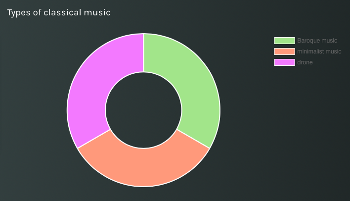

<!DOCTYPE html>
<html>
<head>
  <title>Theatres in the UK and classical music: a love story</title>
<meta name="viewport" content="width=device-width, initial-scale=1">

  
</head>
<body>

  <a href="https://giuliam2.github.io/6-Girls-on-a-stage-home/">Home</a>
  <a class="active" href="https://bella2402.github.io/Theatres-in-the-UK-and-Classical-Music/">Theater</a>
  <a href="file:///C:/Users/giuli/Desktop/UNIBO/informatica/progetto/1.%20Storia%20Rock.htm">Rock Music</a>
  <a href="https://bella2402.github.io/The-History-of-the-Guitar/">Guitars</a>
  <a href="https://giuliam2.github.io/Reports/">Our Reports</a>

  

    <h1>Theatres in the UK and classical music: a love story</h1>
  

  <h2><em>A story written by Isabella Porrovecchio and Eleonora Pellegrini</em></h2>
  
Come discover all the ins and outs about theatres and classical music in the UK! By following this guide there will be no mysteries left out for you about these incredible museums of music, as we like to call them. Did I forget to say? This research was carried out by two students who are fond of theatres and classical music, and who will be delighted to take you on this illuminating journey with them!

  

    

      
We have always wondered: what is it that makes UK theatres so fascinating? Come find it out with us. Firstly, we researched the number of theatres in UK and in London to get a concrete overview on how popular they are in the Anglo-Saxon world. However, nothing’s better than getting to see clearly on a zoomable map where these theatres are located exactly. Thus, if you ever feel like going on a trip to the UK, don’t forget to check them out. Our extensive research proceeded with a visual hint on what the theatres in the UK look like. We believe, in fact, that the beauty of a theatre not only resides in the music created inside but also on the breath-taking architectural appearance one can appreciate from the outside. You will realize, through navigating the table on Melody, that UK showcases theatres from all the kind of architectural styles one can imagine. Victorian Theatres, Art Deco, Brutalist and Modernist are just some examples that can be found in this beautiful country. 

    

    

      
    

  

  

    
If you ever feel worried about whether you’ll find a seat for a last-minute concert, we have got you covered. In our nicely illustrated bar chart, you will be able to understand the capacity of UK’s theatres that shows the number of theatres that have a certain amount of seats from the one that can host the greatest audience to the tiniest ones. But to give you some more of the real data, an interesting table showing the inauguration year of the oldest theatres in the UK can be found. We personally advice you to check the iconic Globe Theatre out if you haven’t yet. Did you know that it was there that Shakespeare and his recital company used to act? Well, if you didn’t, do not worry, you can still go see some his most famous plays as they are on scene pretty much every week. Finally, moving towards the end of our recollection of information about theatres in the United Kingdom, you will encounter some names that might not instantly ring a bell to you, but they are actually some of the well-known composers from UK. As classical music is the most played genre in theatres, we thought one could also positively value some information about classical music composers who were born in the UK, and whose music was obviously played in UK theatres. If you’re starting to get more interested in classical music, you can visualize on our chart the main types of classical music with a nice description that explains them all. And of course, we couldn’t leave you without a nicely catalogue of classical compositions featuring influential figures of classical music such as Bach. Now, are you ready to explore?

  

  

    

    
    

  

 
  <a href="https://melody-data.github.io/stories/published_stories/story_1685701970.977932.html">Click here to see our story on Melody!</a>
  
 
 
<footer>
  
All rights reserved to the 6girlsonstage's project.

</footer>

</body>
</html>
